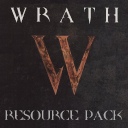

# Wrath

<a class="ct_button" href="https://ceterai.github.io/Workshop/Minecraft/Packs/Wrath">WEBSITE</a> | <a class="ct_button" href="https://github.com/Ceterai/wrath-resource-pack">GITHUB</a> | <a class="ct_button" href="https://buymeacoffee.com/ceterai">DONATE</a> | <a class="ct_button" href="https://discord.gg/gGEwZ5vbgr">DISCORD</a> 
<a class="ct_button" href="https://www.planetminecraft.com/texture-pack/wrath-resource-pack/">PLANET MINECRAFT</a> | <a class="ct_button" href="https://www.curseforge.com/minecraft/texture-packs/wrath-resource-pack">CURSE FORGE</a>

A Quake-styled resource pack for Minecraft 1.21.
This resource pack was partially inspired by Quake II, Doom 3 and similar games.
This is work in progress, so not all things are working properly right now.

The Wrath Resource Pack is being made for CurseForge and PlanetMinecraft specifically, please credit me (Ceterai) if you decide to distribute it elsewhere.

## Links

- [PlanetMinecraft](https://www.planetminecraft.com/texture-pack/wrath-resource-pack/)
- [GitHub](https://github.com/Ceterai/wrath-resource-pack) (report issues here)
- [CurseForge](https://www.curseforge.com/minecraft/texture-packs/wrath-resource-pack) (see more screenshots here)

## Credits

- Quake II font (for the pack logo) by Dead Pete.

---

  

